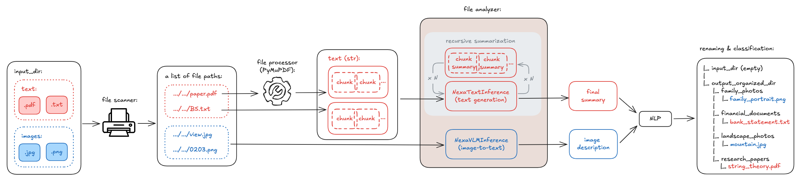

## On-device-File-Manager

### Introduction:

A self-organizing file manager that uses Nexa SDK and NLP models to automatically summarize, classify, rename, and organize files based on their content.

### Technical Architecture:



### Demo:


### Setup:

1. Create & activate the virtual environment:
   ```
   conda create --name file_manager python=3.10
   conda activate file_manager
   ```
2. Upgrade the pip package manager to the latest version within the venv:
   `python -m pip install --upgrade pip`
3. Install required packages:
   - Install Nexa SDK for inference: `pip install nexaai`
   - Install PyMuPDF library for data extraction: `pip install PyMuPDF`
4. Generate a snapshot of the installed packages and their versions to the requirements.txt file (or overwrite the txt file): `pip freeze > requirements.txt`

### Usage:

- Clone using the web URL: https://github.com/qmeng222/On-device-File-Manager.git
- Create and activate your own virtual environment
- Install all the packages and their respective versions specified in the requirements.txt file: `pip install -r requirements.txt`
- Run the application: `python main.py`

### Resources:

1. [Nexa SDK](https://pypi.org/project/nexaai/)
2. [Nexa Model Hub](https://www.nexaai.com/models)
3. [Nexa SDK | GGUF Interface](https://docs.nexaai.com/sdk/python-interface/gguf)
